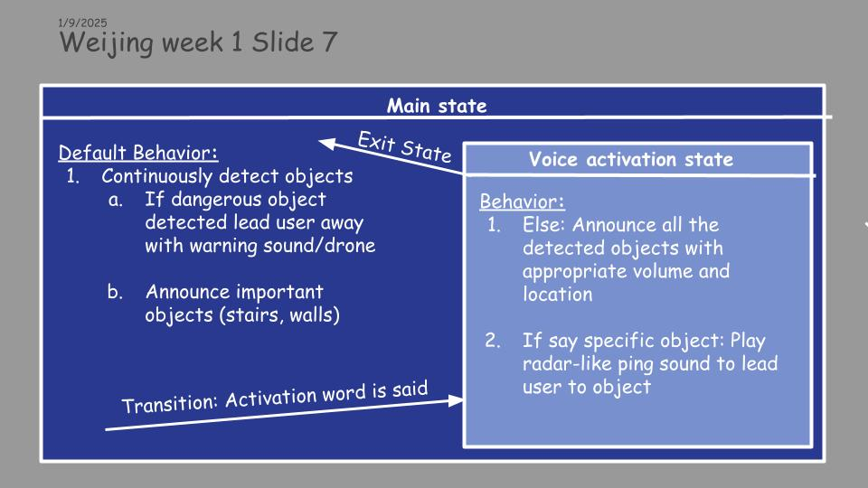

# First demo install tutorial



State chart of design

Current demo has volume problem because the DepthAnything2 used here is not metric.

- plays sine wave with panning based on detected person's x-location
- realtime webcam ~2FPS on my mac
- show non-metric depth map 
- and yolo boxes


## Setup

First get the checkpoint
```bash
cd checkpoints

./download_ckpts.sh

cd ..
```


## Virtual Environment

Then setup virutal environment

```bash 
conda create -n wjdemo python=3.11 -y

conda activate wjdemo

pip3 install torch torchvision --index-url https://download.pytorch.org/whl/cu121
```

and pip some other stuff...


## run

```
python main.py
```


## Problem

If on M1 mac and have any problems running, do:
```export PYTORCH_ENABLE_MPS_FALLBACK=1```


## Credits 

Thanks to khw11044 for tutorial on depth anything webcam
https://github.com/khw11044/Depth-Anything-V2-streaming

And marmik_ch19 for temporary command line fix for pytorch error on mac
https://www.reddit.com/r/pytorch/comments/1c3kwwg/how_do_i_fix_the_mps_notimplemented_error_for_m1/

Warning sound by foosiemac from
https://freesound.org/people/foosiemac/sounds/110395/
