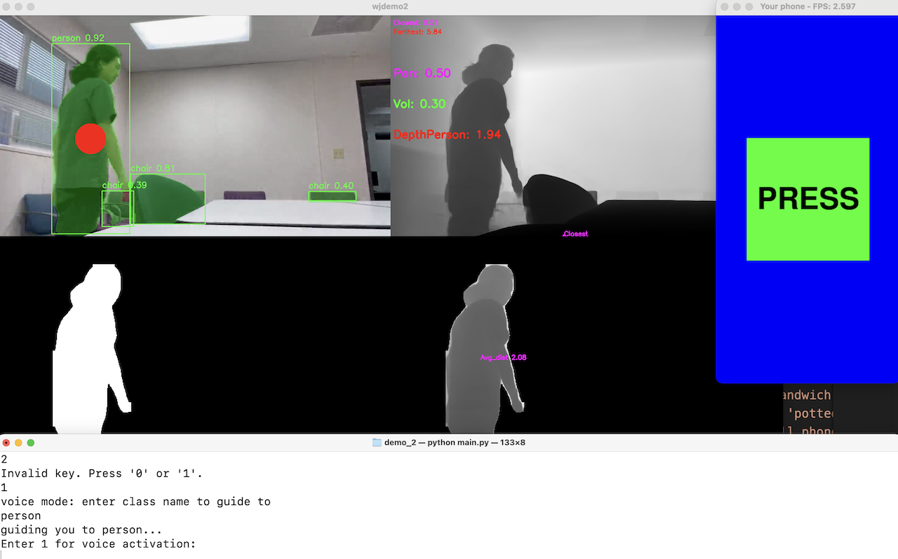

# Second demo install tutorial



Working of Demo2 (running at ~300ms per frame on my mac CPU only)

The openCV webcam thing has **4 windows**:
1) shows webcam with YOLO boxes and SAM
2) shows depthAnythingV2 metric map
3) shows SAM mask of target (if target selected)
4) shows masked portion of depth for target (if target selected)

The Pygame GUI:
- Pressing the green button once will print all the detected objects. 
- Holding and double clicking not implemented yet
- background is normally white but turns **RED for DANGER**, and *blue for important object*

**Terminal user input**:
- enter 0 for main state
- enter 1 for voice activation mode
- **inside voice mode enter a COCO class to set as target**
- *This will guide you towards target until you reach it*


## Setup

First get the checkpoint
```bash
cd checkpoints

./download_ckpts.sh

cd ..
```

If it doesn't work, manually download here and place it in checkpoints folder:

https://huggingface.co/depth-anything/Depth-Anything-V2-Metric-Hypersim-Small/resolve/main/depth_anything_v2_metric_hypersim_vits.pth?download=true


You will need to git clone both Depth-Anything-V2 (https://github.com/DepthAnything/Depth-Anything-V2?tab=readme-ov-file#pre-trained-models) and SORT (https://github.com/abewley/sort?tab=readme-ov-file)

You will also need to rename the Depth-Anythin-V2 folder to DA2


## Virtual Environment

Then setup virutal environment

```bash 
conda create -n wjdemo python=3.11 -y

conda activate wjdemo

pip3 install torch torchvision --index-url https://download.pytorch.org/whl/cu121
```

and pip some other stuff...


## run

```
python main.py
```


## Problem

If on M1 mac and have any problems running, do:
```export PYTORCH_ENABLE_MPS_FALLBACK=1```


## Credits 

Thanks to khw11044 for tutorial on depth anything webcam
https://github.com/khw11044/Depth-Anything-V2-streaming

And marmik_ch19 for temporary command line fix for pytorch error on mac
https://www.reddit.com/r/pytorch/comments/1c3kwwg/how_do_i_fix_the_mps_notimplemented_error_for_m1/

Warning sound by foosiemac from
https://freesound.org/people/foosiemac/sounds/110395/
