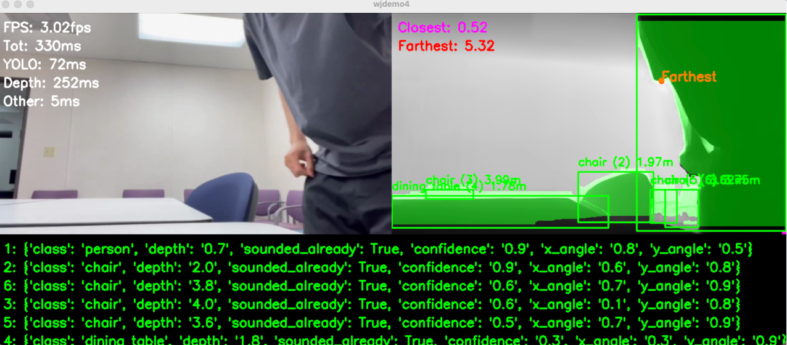

# Fourth Demo Install Tutorial 

<table>
<tr>
<td>

This is the fourth demo for our CAPSTONE project **CViSion**. CViSion is an audio guide for the visually impaired that uses AI object detection, depth maps, and other modules to process video input. Based on the detections, spatial audio is generated for the user through headphones.

</td>
<td>

Fig 1. CViSion Logo
</td>
</tr>
</table>



Fig 2. Demo4 Normal mode (running at 3fps on my Mac CPU only. ~10FPS on GPU computer)

- There are two current modes in this demo.
- There is a normal mode that announces all new objects that appear on the screen with spatial audio.
- There is also a tracking mode that will play a tone to guide you towards that object until 1 meter away.
- Finally, there is a WIP pygame GUI that is non-functional in this demo.
- *The danger mode is not implemented yet*

**Terminal user input**:
- enter 0 for main state
- enter 1 for voice activation mode
- **inside voice mode enter an object ID to set as target**
- *This will guide you towards target until you reach it*


## Setup

First get the checkpoint
```bash
cd checkpoints

./download_ckpts.sh

cd ..
```

If it doesn't work, manually download here and place it in checkpoints folder:

https://huggingface.co/depth-anything/Depth-Anything-V2-Metric-Hypersim-Small/resolve/main/depth_anything_v2_metric_hypersim_vits.pth?download=true


<!-- You will need to git clone both Depth-Anything-V2 (https://github.com/DepthAnything/Depth-Anything-V2) and SORT (https://github.com/abewley/sort) -->

In the main directory:
```
git clone https://github.com/DepthAnything/Depth-Anything-V2
```
<!-- git clone https://github.com/abewley/sort -->

You will also need to **rename the depth_anything_v2 folder to DA2**


## Virtual Environment

Then setup virtual environment

```bash 
conda create -n wjdemo python=3.11 -y

conda activate wjdemo

pip3 install torch torchvision --index-url https://download.pytorch.org/whl/cu121
```

and pip some other stuff...


## run

```
python main.py
```


## Problem

If on M1 mac and have any problems running, do:
```export PYTORCH_ENABLE_MPS_FALLBACK=1```


## Credits 

Thanks to khw11044 for tutorial on depth anything webcam
https://github.com/khw11044/Depth-Anything-V2-streaming

And marmik_ch19 for temporary command line fix for pytorch error on mac
https://www.reddit.com/r/pytorch/comments/1c3kwwg/how_do_i_fix_the_mps_notimplemented_error_for_m1/

Warning sound by foosiemac from
https://freesound.org/people/foosiemac/sounds/110395/
